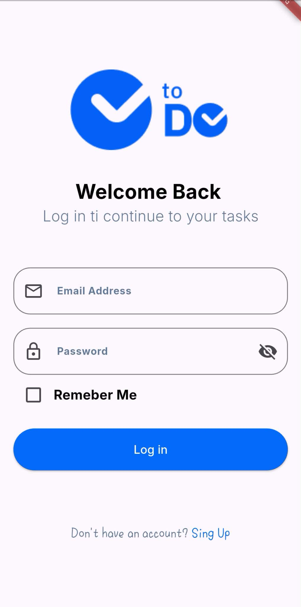
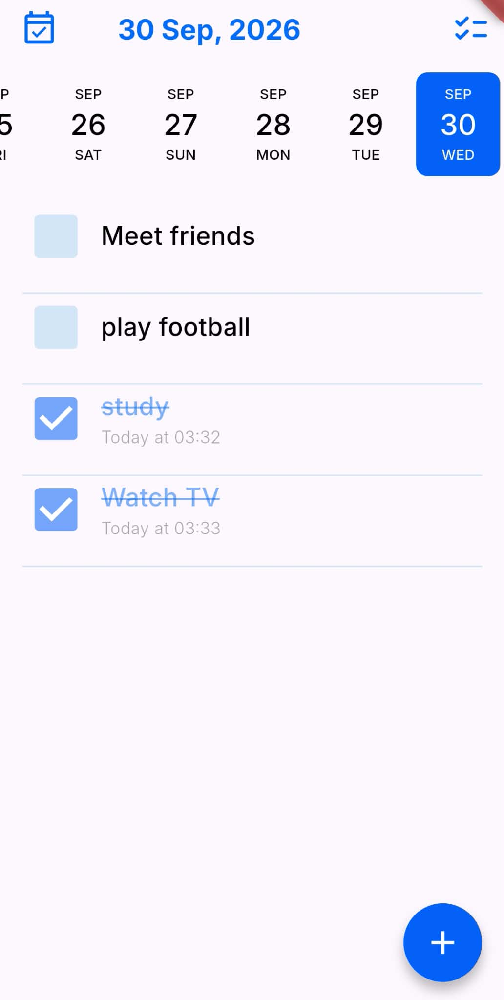
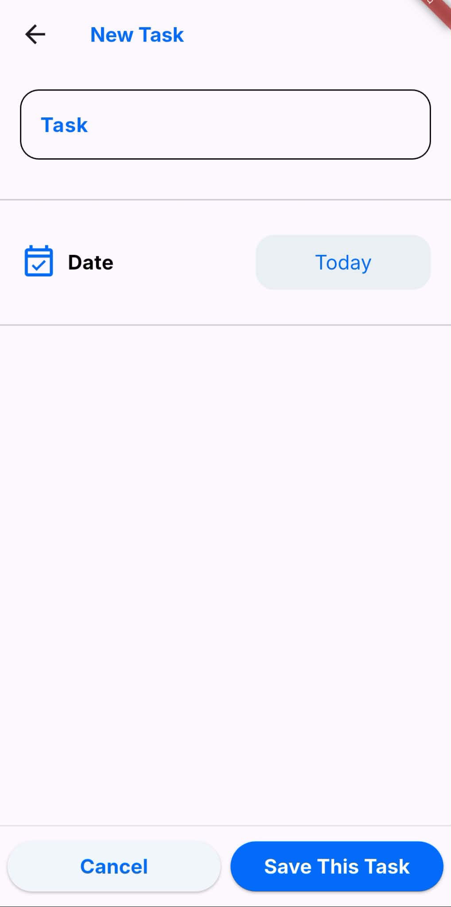
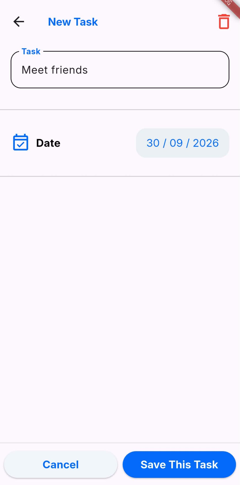
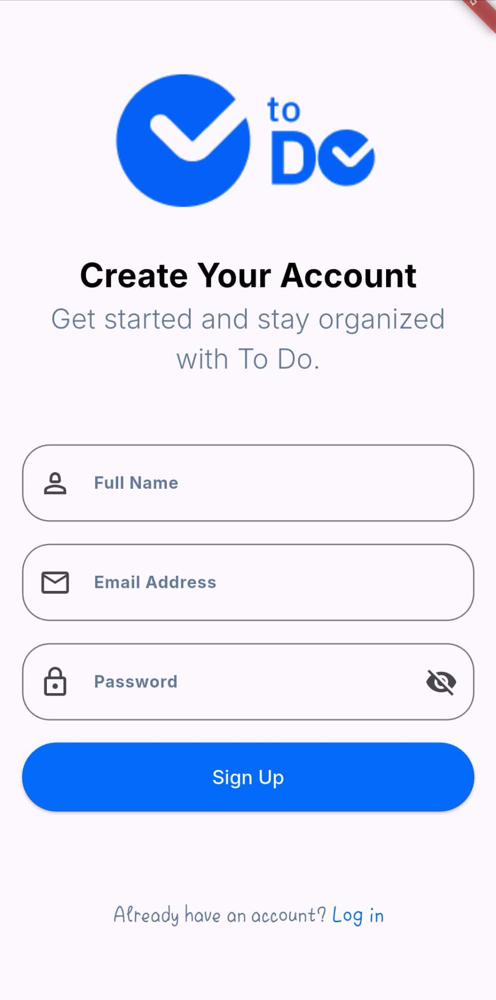

# 📝 To-Do App

A modern and clean To-Do mobile application built with **Flutter & Dart**, designed to provide a simple and intuitive task-management experience while applying structured architecture, state management, and Firebase integration.

<p align="center">
  
  
  
  
  
</p>

---

## 📱 Preview

<p align="center">
  
  
  
  
</p>

---

## ✨ Features

### 🔐 Authentication

* User registration
* User login
* Authentication state handling
* User-specific data access
* Email verification

### 📋 Task Management

* Create new tasks
* Edit existing tasks
* Delete tasks
* Organize tasks by date
* Manage task status
* View pending and completed tasks
* Task history

### 🎨 User Interface

* Clean and modern UI
* Responsive layouts
* Reusable Flutter widgets
* Smooth user interactions
* Consistent design system

### ☁️ Cloud Integration

* Firebase Authentication
* Cloud Firestore
* Real-time data synchronization
* User-specific task data

---

## 🛠️ Tech Stack

| Technology              | Usage                          |
| ----------------------- | ------------------------------ |
| Flutter                 | Mobile application development |
| Dart                    | Programming language           |
| Firebase Authentication | User authentication            |
| Cloud Firestore         | Cloud database                 |
| Cubit / BLoC            | State management               |
| Layered Architecture    | Code organization              |

---

## 🏗️ Architecture

The project follows a **Layered Architecture** to separate responsibilities and keep the code organized, maintainable, and easier to extend.

```text
┌──────────────────────────────┐
│        Presentation         │
│                              │
│  Screens • Widgets • Cubit  │
└──────────────┬───────────────┘
               │
               ▼
┌──────────────────────────────┐
│       Business Logic        │
│                              │
│     Application Logic       │
│     State Management        │
└──────────────┬───────────────┘
               │
               ▼
┌──────────────────────────────┐
│            Data             │
│                              │
│ Firebase Auth • Firestore   │
│ Models • Data Sources       │
└──────────────────────────────┘
```

### Application Flow

```text
User
 │
 ▼
Flutter UI
 │
 ▼
Cubit / BLoC
 │
 ▼
Application Logic
 │
 ▼
Data Layer
 │
 ├── Firebase Authentication
 │
 └── Cloud Firestore
```

## 📸 Screenshots

### 🔐 Authentication

<p align="center">
  
  
</p>

### 🏠 Home

<p align="center">
  
</p>

### ➕ Add & Edit Tasks

<p align="center">
  
  
</p>

---

## 🎯 What I Practiced

This project helped me strengthen my understanding of:

* Flutter UI development
* State management with Cubit / BLoC
* Firebase integration
* Firebase Authentication
* Cloud Firestore
* CRUD operations
* Real-time data synchronization
* Layered Architecture
* Reusable widgets
* Form validation
* Managing application states
* Connecting UI with business logic and data

---

## 🚀 Getting Started

### 1. Clone the repository

```bash
git clone https://github.com/omarsa123/to-do-app.git
```

### 2. Navigate to the project

```bash
cd to-do-app
```

### 3. Install dependencies

```bash
flutter pub get
```

### 4. Configure Firebase

Connect the project to your Firebase project and add the required Firebase configuration files.

### 5. Run the application

```bash
flutter run
```

---

## 🔮 Upcoming Features

The following features are planned for future versions:

* 🔔 **Local Notifications** — Remind users about upcoming tasks.
* 🌙 **Dark Mode** — Support for light and dark themes.
* 🔎 **Task Search & Filtering** — Quickly find and filter tasks.
* 📊 **Task Statistics** — Track completed, pending, and overall task progress.
* 🔄 **Offline Support** — Allow users to access and manage tasks without an internet connection.
* 🏷️ **Task Categories & Priorities** — Organize tasks based on categories and priority levels.
* 🔁 **Recurring Tasks** — Support for tasks that repeat daily, weekly, or monthly.

---

## 👨‍💻 Author

**Omar Sawan**

Flutter Developer | Mobile Application Development

---

<p align="center">
  Built with 💙 using Flutter
</p>

